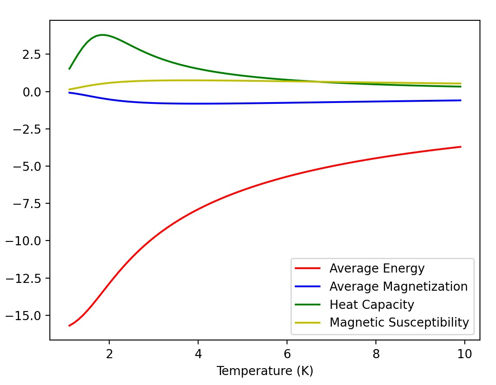
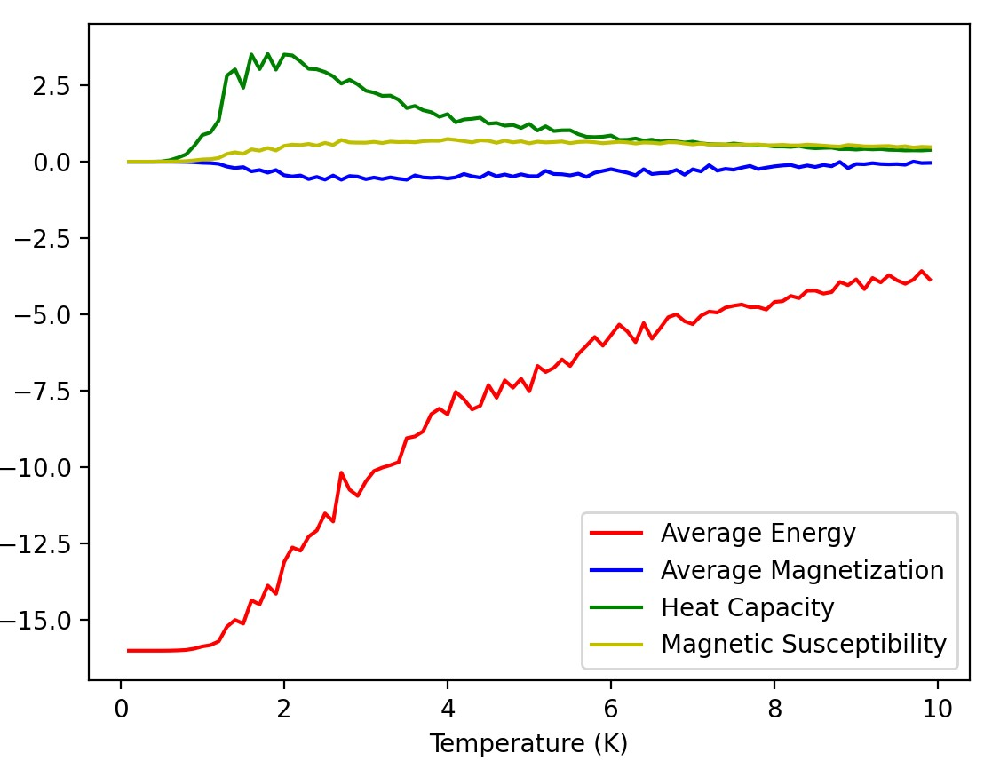
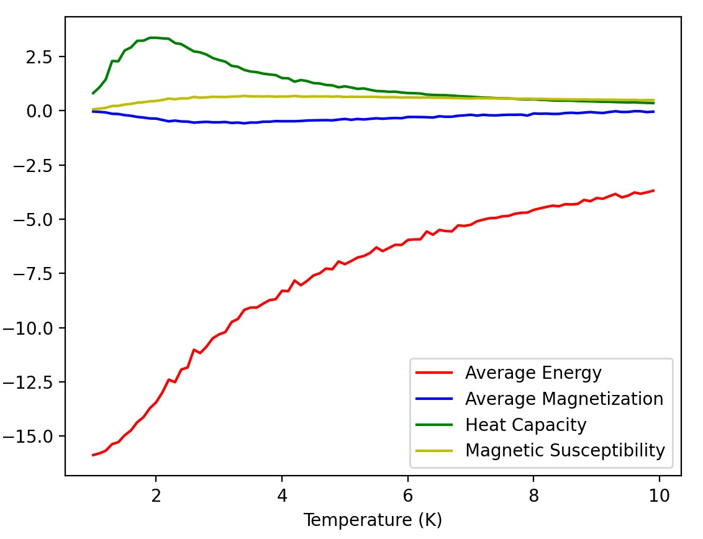

Getting Started
===============

This page details how to get started with montecarlo. Montecarlo is a package which was developed for the calculation of classical hamiltonians

Installation
------------
To install montecarlo, you will need an environment with the following packages:

* Python 3.7
* NumPy
* Matplotlib

Once you have these packages installed, you can install montecarlo in the same environment using
::

    pip install -e .

Background
------------
.. math::
    \frac{H}{k} = -\frac{J}{k}\sum s_i s_{i+1}+\frac{\mu}{k}\sum s_i

This is the equation of the 1D spin lattice hamiltonian. This can be used to compute the energy levels of a spin lattice structure, and by extension the probability of it occuring using the Boltzmann distribution. However, these structures may have more important charactaristics, like magnetization. Using that, we can compute the average energy and average magnetization of all states of a certain size, and from there determine the heat capacity and magnetic susceptibility. Magnetization can be written as such

.. math::
    M = \sum s_i

And the heat capacity can be calculated using expectation values of energy, and magnetic susceptibility using expectation values of magnetization. This package can calculates both values exactly, as well as approximate it using the montecarlo metropolis method.

Examples
------------
Here's a sample code with the montecarlo package

.. code-block:: python

    from montecarlo import *

    lattice = spin_config_1D(n=2,temp=1)
    print(lattice)
    lattice.generate_plot()

which generates the output

::

    States: [[-1, -1], [-1, 1], [1, -1], [1, 1]]
    Energies: [1.7999999999999998, -3.9999999999999996, -4.0, 6.199999999999999]
    Magnetizations: [-2, 0, 0, 2]
    Probabilities: [0.0015114612660751597, 0.4992349910051053, 0.4992349910051055, 1.8556723713926915e-05]
    Average Energy: -3.9910442460748814
    Average Magnetization: -0.0029858090847224654
    Heat Capcity: 0.0526959929976023
    Magnetic Susceptibility: 0.0526959929976023
    Constants
	    Boltzmann Constant is: 1
	    J is: -2
	    mu is: 1.1
	    Temperature is: 1

However, we can also simulate a simular plot using the metropolis sampling. The default metro_plot() function generates a plot similar to the default generate_plot() method. Continuing from the previous code block

.. code-block:: python

    metro_plot()

generates an output similar to	

(note, the outputs won't be exactly the same)
As you can see, this is an approximation. We can make this approximation better by increasing the number of sweeps we include.

.. code-block:: python

    metro_plot(sweeps = 10000)

generates the output

note how the output is smoother. More sweeps allows you to be more accurate with your plots, at a cost of a higher computation time.
